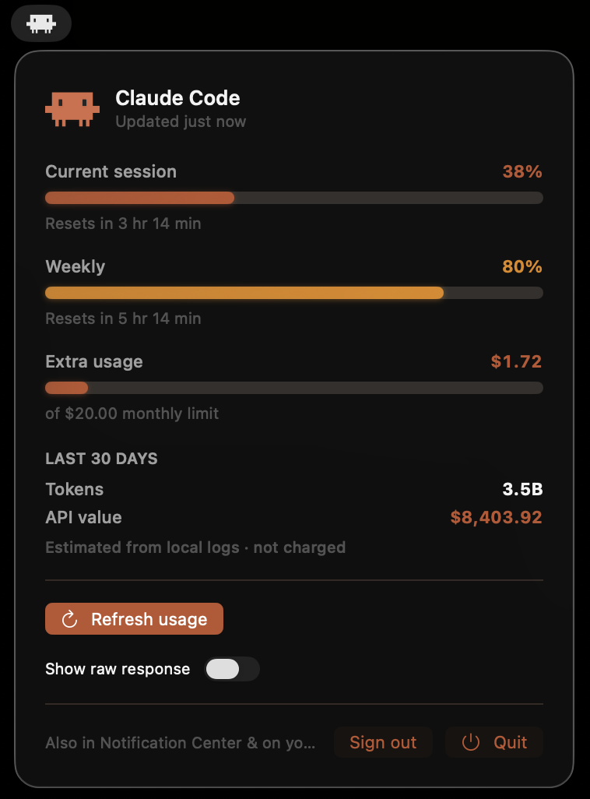
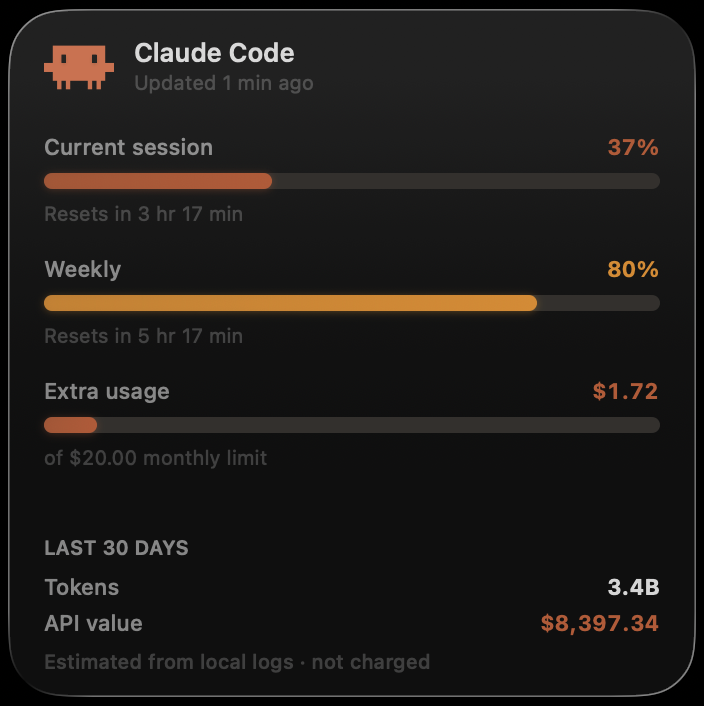
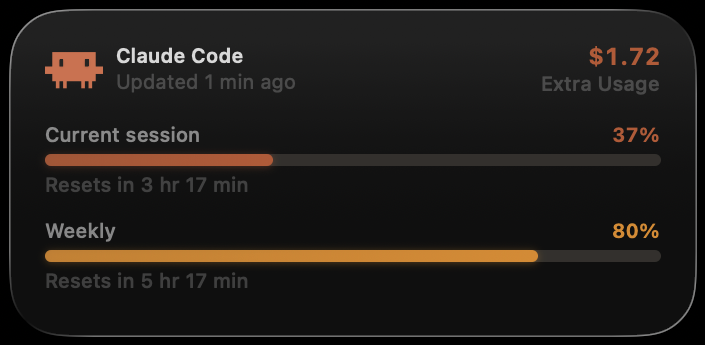
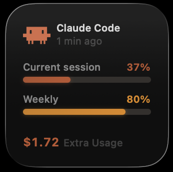

# AI Monitor

> [!IMPORTANT]
> **This codebase was written 100% by [Claude Code](https://claude.com/claude-code), with no human code review or intervention.** Every line — Swift sources, the Tuist setup, the docs you're reading — was produced by the agent. Treat it as an experiment in agent-authored software, **not** as a reference for how to write good code. It has not been audited, and its patterns shouldn't be taken as best practice.

A native macOS app that keeps an eye on your AI tool usage — starting with
**Claude Code**. See, at a glance, how much of your rolling usage limits you've used
and an estimate of what that usage is "worth".

## Features

- Three surfaces, one dashboard:
  - **Menu-bar window** — click the menu-bar icon.
  - **Notification Center widget**.
  - **Native desktop widget** (macOS 14+).
- At-a-glance metrics:
  - **Current session** (5-hour) rolling limit, with reset time
  - **Weekly** rolling limit, with reset time
  - **Extra usage** — what you're charged for usage beyond the plan
  - **Est. API value** — what the last 30 days of tokens would cost at API list prices (not your bill — see below)
  - A **"just now / 2 min ago"** freshness label
- Auto-refresh.

## Screenshots

### Menu-bar panel

Click the menu-bar icon to open the dashboard, refresh on demand, and inspect the raw response.



### Large widget

The full dashboard: both rolling limits with reset times, the extra-usage charge, and the estimated API value.



### Medium widget

Both limit bars with reset lines, and the extra-usage charge in the header.



### Small widget

A compact view: both limit bars and the extra-usage charge.



## Requirements

- macOS 14 (Sonoma) or later
- [Tuist](https://tuist.io) to generate the Xcode project
- Xcode command line tools
- A Claude account to sign in with (see [Authentication](#authentication)). Having
  [Claude Code](https://claude.com/claude-code) installed is only needed for the
  local-log-based "Est. API value" figure.

## Authentication

The app signs in with **your Claude account, in your browser**, using OAuth 2.0 +
PKCE — the same (unofficial) flow and public client ID the Claude Code CLI uses.
It never reads Claude Code's keychain item, and it never sees your password.

How it works, step by step:

1. **You click "Sign in with Claude"** in the menu-bar panel. The app opens the
   Claude approval page in your browser, carrying a one-time PKCE challenge.
2. **You approve, and paste back the code.** The page displays a short code; paste
   it into the panel. The app exchanges code + PKCE verifier for an access token
   and a refresh token. No local web server, no password handling.
3. **The tokens are stored in the app's own Keychain item** (a generic password
   created by AI Monitor itself, so there's no "wants to use confidential
   information" prompt). They are **never logged or written anywhere else**.
4. **Each fetch sends the access token** as a `Bearer` token on a single HTTPS `GET`
   to the usage endpoint (`api.anthropic.com/api/oauth/usage`) — the same unofficial
   endpoint Claude Code's `/usage` command uses. When the token expires, the app
   refreshes it automatically with the refresh token. The usage figures it gets back
   (limit percentages, reset times, extra-usage charge) contain no secrets, so only
   those are shared with the widget via the App Group — never the tokens.

**Sign out** from the bottom of the panel any time — it deletes the stored tokens.

> **Honesty note.** Anthropic has no official third-party OAuth registration, so this
> flow (like the usage endpoint itself) is community-discovered and unofficial. It may
> change or stop working at any time; the app degrades to an honest error when it does.

> **Note on code signing.** macOS ties Keychain access to the app's code signature.
> The build re-signs with a stable self-signed identity (`AIMonitorDev`) so the app
> can keep reading its own Keychain item across rebuilds; an ad-hoc signature changes
> every build and would lose access each time.

## Build & run

```bash
tuist generate        # generates AIMonitor.xcodeproj and opens it
# or, headless:
tuist generate --no-open
xcodebuild -scheme AIMonitor -destination 'platform=macOS' build
```

The app runs as a menu-bar item (no Dock icon).

### Rebuilding — the full loop (don't skip the re-sign + install)

A plain `xcodebuild ... build` is **not enough** to see your changes. Code signing is
turned **off** in the project (`CODE_SIGNING_ALLOWED = NO`), so the build leaves an
unsigned bundle in DerivedData — and **macOS discovers the widgets from
`/Applications`, not DerivedData**. You must re-sign and install. The reliable loop:

```bash
tuist generate --no-open                                            # only after add/rename/delete of files
xcodebuild -scheme AIMonitor -destination 'platform=macOS' build    # confirm "BUILD SUCCEEDED"

# DerivedData has a per-machine hash; resolve the real path with the command below.
APP="$(xcodebuild -scheme AIMonitor -destination 'platform=macOS' -showBuildSettings | awk -F' = ' '/ TARGET_BUILD_DIR =/{print $2; exit}')/AIMonitor.app"
APPEX="$APP/Contents/PlugIns/AIMonitorWidget.appex"

# Re-sign with the stable self-signed identity — appex FIRST, then the host app
# (so the app's seal captures the appex). Keeps access to the app's keychain item.
codesign --force --sign "AIMonitorDev" --entitlements Widget/AIMonitorWidget.entitlements "$APPEX"
codesign --force --sign "AIMonitorDev" --entitlements Sources/AIMonitor.entitlements "$APP"

# Install to /Applications (where macOS looks for the widget), register, launch.
killall AIMonitor 2>/dev/null; rm -rf "/Applications/AIMonitor.app"; cp -R "$APP" "/Applications/"
/System/Library/Frameworks/CoreServices.framework/Frameworks/LaunchServices.framework/Support/lsregister -f /Applications/AIMonitor.app
open /Applications/AIMonitor.app
```

### After rebuilding — refresh the running app and widgets

1. The **menu-bar app** is replaced by the `killall` + `open` above — click the gauge
   icon to see the panel with the latest code.
2. The **widgets** are cached aggressively by macOS. Bounce the widget daemons so they
   reload the new extension binary:
   ```bash
   killall chronod NotificationCenter 2>/dev/null
   pluginkit -m -i com.aimonitor.app.widget   # verify it prints: com.aimonitor.app.widget(<ver>)
   ```
3. If a placed widget still shows the old layout, **remove it and re-add it** from the
   widget gallery — that forces it to bind to the freshly installed extension.

> Notes / gotchas (learned the hard way):
> - Sign the **appex before** the host app, or the app's seal won't cover the new appex.
> - Use the stable **`AIMonitorDev`** identity (Keychain Access → Certificate Assistant
>   → Create a Certificate, type *Code Signing*), not adhoc — adhoc's requirement is the
>   binary hash, which changes every rebuild and loses access to the app's own keychain
>   item (where the OAuth tokens live).
> - The host app and widget `CFBundleShortVersionString`/`CFBundleVersion` must match or
>   embedding warns.
> - If the DerivedData path hash changes, recompute it:
>   `xcodebuild -showBuildSettings | grep TARGET_BUILD_DIR`.

## A note on "cost"

If you're on a Claude subscription, the dollar figure this app shows is **not what you
pay** — your plan is a flat monthly fee. The number is an estimate of what the same
token usage *would* cost at pay-as-you-go API list prices, shown as a sense of
"value extracted". It is always labeled as an estimate.

## A note on the limit data

The real 5-hour and weekly limit percentages come from an **unofficial** endpoint (the
same one Claude Code's `/usage` command uses). It is community-discovered, undocumented,
and could change or stop working at any time. When it's unavailable, the app falls back
to locally-computed token/cost figures. Token counts and cost are derived entirely from
local logs on your machine; nothing is sent anywhere except the usage endpoint itself.

## License

**Anyone is free to use this project and to make and modify their own copy of it** —
for personal or commercial purposes, at no cost. Clone it, fork it, change whatever you
like, and ship it in your own work.

It's released under the [MIT License](LICENSE). The only condition is that you keep the
copyright and license notice in copies you distribute. The software is provided "as is",
with no warranty.

© 2026 Rodrigo Busata.
